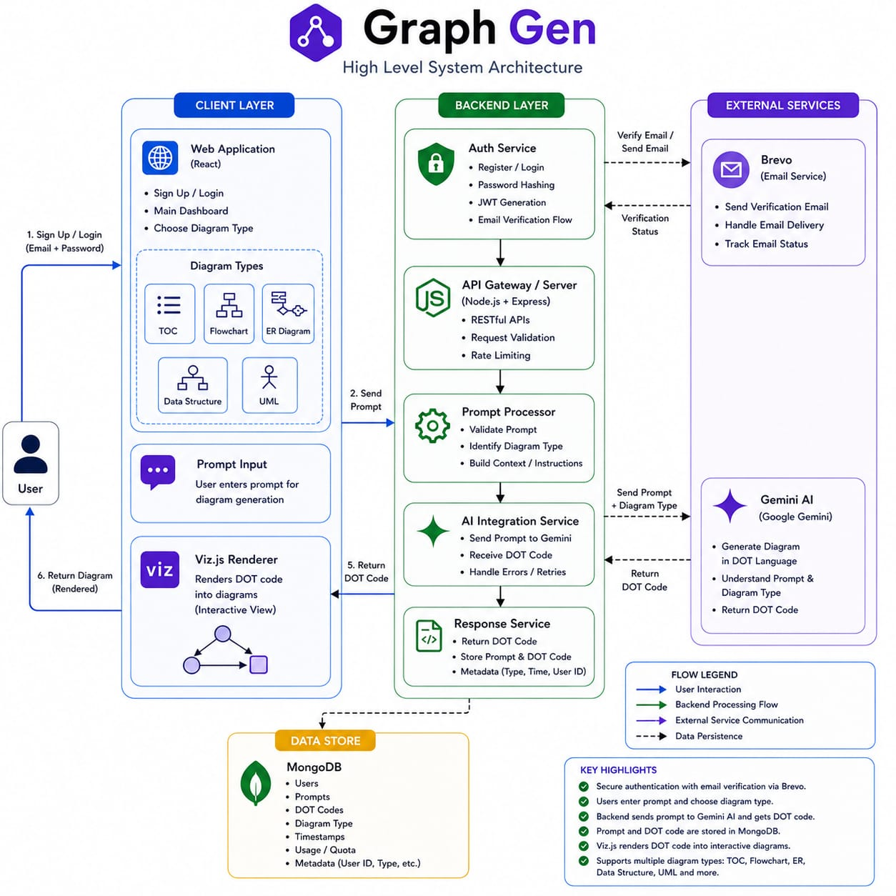

# GraphGen — High-Level Design (HLD)

---

## System Architecture



---

## 1. Introduction

**GraphGen** is an AI-powered diagram generation platform that converts natural language descriptions into professional, interactive diagrams. The system follows a **three-tier architecture**: a React-based client layer, a Node.js/Express backend layer, and external service integrations (Gemini AI, Brevo Email, MongoDB Atlas).

---

## 2. Architecture Layers

### 2.1 Client Layer (Frontend)

| Component | Technology | Responsibility |
|-----------|------------|----------------|
| Web Application | React + Vite | SPA with routing, forms, and dashboard |
| Diagram Types | DFA, NFA, Flowchart, ER, Data Structure, UML | User selects type and enters prompt |
| Viz.js Renderer | `graphviz-react` | Renders DOT code into interactive SVG diagrams |
| State Management | localStorage + React state | JWT token storage, user session |

**User Flow:**
1. User signs up / logs in via the auth pages
2. Navigates to dashboard and selects a diagram type
3. Enters a natural-language prompt describing the diagram
4. Receives a rendered, interactive diagram in the browser

### 2.2 Backend Layer (Server)

The backend is the central orchestrator, handling five major responsibilities:

| Service | Role |
|---------|------|
| **Auth Service** | User registration, login, JWT generation, password hashing (bcrypt), email verification flow |
| **API Gateway** | Express router — RESTful endpoint routing, CORS enforcement, rate limiting |
| **Prompt Processor** | Input validation, diagram type identification, prompt template loading and context building |
| **AI Integration Service** | Two-stage Gemini API pipeline — sends reasoning prompt, then DOT generation prompt |
| **Response Service** | Post-processes AI output (strips markdown fences), returns clean DOT code, stores history |

### 2.3 External Services

| Service | Provider | Purpose |
|---------|----------|---------|
| **Gemini AI** | Google | Core AI engine — accepts prompts, returns Graphviz DOT code |
| **Brevo** | Sendinblue | Transactional email delivery — verification and password reset emails |
| **MongoDB Atlas** | MongoDB | Cloud database — stores users, diagram history, and metadata |

---

## 3. Data Flow

### 3.1 Authentication Flow

```
User ──► React App ──► POST /api/auth/login ──► Auth Service
                                                    │
                                          ┌─────────┴─────────┐
                                          ▼                   ▼
                                     MongoDB              Brevo
                                   (verify user)     (send verification
                                                      / reset emails)
                                          │
                                          ▼
                                    JWT Token ──► Client (localStorage)
```

### 3.2 Diagram Generation Flow

```
User ──► Select Diagram Type ──► Enter Prompt ──► POST /api/diagram/*
                                                        │
                                                  [ JWT Auth Check ]
                                                        │
                                                        ▼
                                                 Prompt Processor
                                              (load template + validate)
                                                        │
                                                        ▼
                                              ┌─────────────────────┐
                                              │  STAGE 1: REASONING │
                                              │  Gemini AI call     │
                                              │  → Structured       │
                                              │    analysis output  │
                                              └─────────┬───────────┘
                                                        │
                                                        ▼
                                              ┌─────────────────────┐
                                              │  STAGE 2: DOT CODE  │
                                              │  Gemini AI call     │
                                              │  → Graphviz DOT     │
                                              │    source code      │
                                              └─────────┬───────────┘
                                                        │
                                                        ▼
                                                 Post-Process
                                              (strip fences, trim)
                                                        │
                                              ┌─────────┴─────────┐
                                              ▼                   ▼
                                         Response            MongoDB
                                       { vizCode }       (save to history)
                                              │
                                              ▼
                                     Viz.js renders SVG
                                       in browser
```

---

## 4. Supported Diagram Types

| Category | Type | Description | AI Model |
|----------|------|-------------|----------|
| Theory of Computation | **DFA** | Deterministic Finite Automata with states & transitions | gemini-2.5-flash |
| Theory of Computation | **NFA** | Nondeterministic Finite Automata with epsilon transitions | gemini-2.5-flash |
| Software Engineering | **Flowchart** | Process/algorithm visualization (supports code input) | gemma-3-27b-it |
| Database Design | **ER Diagram** | Entity-Relationship models with cardinality | gemma-3-27b-it |
| Data Structures | **Data Structure** | Trees, Graphs, Linked Lists, Hash Tables | gemma-3-27b-it |
| Software Engineering | **UML** | Class, Sequence, Use Case, Activity, State diagrams | gemma-3-27b-it |

---

## 5. Security Architecture

```
┌─────────────────────────────────────────────────────────┐
│                    SECURITY LAYERS                      │
├─────────────────────────────────────────────────────────┤
│                                                         │
│  ┌───────────────┐   ┌────────────────┐                │
│  │ CORS Policy   │   │ Rate Limiting  │                │
│  │ Origin-locked │   │ 5 req/10 min   │                │
│  │ to frontend   │   │ on sensitive   │                │
│  └───────────────┘   └────────────────┘                │
│                                                         │
│  ┌───────────────┐   ┌────────────────┐                │
│  │ JWT Auth      │   │ Password       │                │
│  │ 1-hour expiry │   │ bcrypt(10)     │                │
│  │ Token refresh │   │ select: false  │                │
│  │ on pwd change │   │ on schema      │                │
│  └───────────────┘   └────────────────┘                │
│                                                         │
│  ┌───────────────┐   ┌────────────────┐                │
│  │ API Key       │   │ Email Verify   │                │
│  │ Server-side   │   │ 32-byte token  │                │
│  │ .env only     │   │ 10-min expiry  │                │
│  └───────────────┘   └────────────────┘                │
│                                                         │
└─────────────────────────────────────────────────────────┘
```

---

## 6. Database Design (High-Level)

```
┌──────────────────┐         ┌──────────────────┐
│      Users       │         │     History       │
├──────────────────┤         ├──────────────────┤
│ _id              │◄────────│ userId (ref)     │
│ name             │    1:N  │ actionType       │
│ email (unique)   │         │ inputData        │
│ password (hash)  │         │ outputData       │
│ verified         │         │ timestamps       │
│ token            │         └──────────────────┘
│ tokenExpires     │
│ timestamps       │
└──────────────────┘
```

- **Users** — Stores credentials, verification status, and password-reset tokens
- **History** — Stores every diagram generation event linked to a user (1:N relationship)

---

## 7. Deployment Architecture

```
┌─────────────────────────────────────────────────┐
│              Development Environment            │
├─────────────────────────────────────────────────┤
│                                                 │
│  Frontend:  Vite dev server (port 5173)         │
│  Backend:   Nodemon + Express (port 5050)       │
│  Database:  MongoDB Atlas (cloud)               │
│  AI:        Google Gemini API (cloud)           │
│  Email:     Brevo API (cloud)                   │
│                                                 │
│  Communication: HTTP/JSON over localhost        │
│  Auth tokens:   JWT via Authorization header    │
│                                                 │
└─────────────────────────────────────────────────┘
```

---

## 8. Key Highlights

- ✅ Secure authentication with email verification via Brevo
- ✅ Users enter prompt and choose diagram type from the dashboard
- ✅ Backend sends prompt to Gemini AI using a **two-stage pipeline** and gets DOT code
- ✅ Prompt and DOT code are stored in MongoDB as user history
- ✅ Viz.js renders DOT code into interactive, zoomable/pannable diagrams
- ✅ Supports multiple diagram types: TOC (DFA/NFA), Flowchart, ER, Data Structure, UML
- ✅ Server-only API key management — no client-side key exposure

---

*Document generated on 2026-05-05. Refer to [LLD.md](./LLD.md) for the detailed low-level design.*
