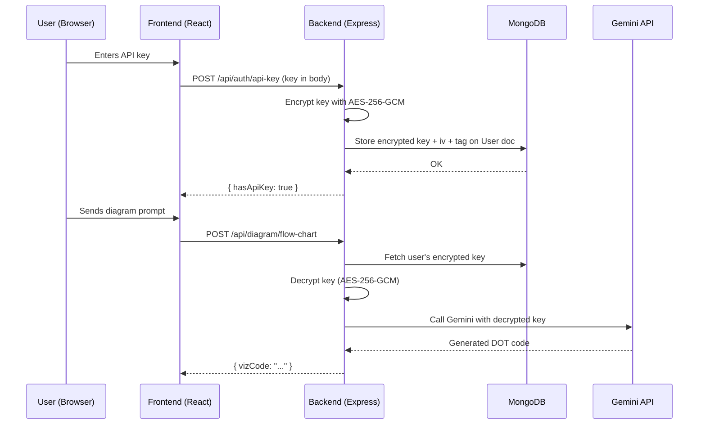

# Secure API Key Management — Implementation Plan

## Architecture Overview



## Changes Summary

### Backend — ✅ Complete

| File | Action | Purpose | Status |
|------|--------|---------|--------|
| `.env` + `.env.example` | Add `ENCRYPTION_KEY` | 32-byte hex secret for AES-256-GCM | ✅ |
| `utils/encryption.js` | **New** | `encrypt(text)` / `decrypt(cipherObj)` helpers | ✅ |
| `utils/getUserApiKey.js` | **New** | Shared utility to decrypt user key with env fallback | ✅ |
| `models/userModel.js` | Edit | Add `geminiApiKey` embedded subdoc (iv, content, tag) | ✅ |
| `routes/userRoute.js` | Edit | Add 3 protected routes (POST, GET, DELETE) for key CRUD | ✅ |
| `controllers/authentication/apiKey.js` | **New** | Save / status / delete controller | ✅ |
| All 6 diagram controllers | Edit | Use `getUserApiKey()` instead of `process.env.GEMINI_API` | ✅ |

### Frontend — ✅ Complete

| File | Action | Purpose | Status |
|------|--------|---------|--------|
| `pages/UserHome/ApiKeyManager.jsx` | **New** | Premium API key config card with toggle, status, toasts | ✅ |
| `pages/UserHome/ApiKeyManager.css` | **New** | Styles for the component | ✅ |
| `pages/UserHome/DashboardHome.jsx` | Edit | Mount `<ApiKeyManager />` above content | ✅ |
| `pages/Profile/Profile.jsx` | Edit | Mount `<ApiKeyManager />` in profile page | ✅ |
| `utils/useApiKeyStatus.js` | **New** | Reusable React hook for key status checking | ✅ |
| `index.css` | Edit | `.no-key-banner` shared styles | ✅ |
| `Flowchart.jsx` | Edit | Banner + hook integration | ✅ |
| `DFA.jsx` | Edit | Banner + hook integration | ✅ |
| `NFA.jsx` | Edit | Banner + hook integration | ✅ |
| `ERDiagram.jsx` | Edit | Banner + hook integration | ✅ |
| `DataStructure.jsx` | Edit | Banner + hook integration | ✅ |
| `UMLDiagram.jsx` | Edit | Banner + hook integration | ✅ |

## Security Design

- **AES-256-GCM** symmetric encryption (Node.js `crypto` built-in — zero extra deps)
- Encryption key lives in `ENCRYPTION_KEY` env var, never committed
- Each key gets a **random IV** and **auth tag** — stored alongside ciphertext
- API key is **decrypted only in-memory**, during a single request lifecycle
- Frontend **never receives** the stored key back — only `hasApiKey: true/false`
- User can **update** (overwrite) or **delete** their key at any time
- Fallback to `process.env.GEMINI_API` when user has no key (for dev/transition)

## Key Files Reference

```
backend/
├── .env                                    # ENCRYPTION_KEY + GEMINI_API
├── utils/
│   ├── encryption.js                       # AES-256-GCM encrypt/decrypt
│   └── getUserApiKey.js                    # Per-request key resolution
├── models/userModel.js                     # geminiApiKey subdocument
├── routes/userRoute.js                     # /api-key CRUD routes
├── controllers/authentication/apiKey.js    # Key management logic
└── controllers/diagramsGenerator/          # All 6 updated controllers

frontend/
├── src/
│   ├── index.css                           # .no-key-banner shared styles
│   ├── utils/
│   │   ├── api.js                          # Axios instance with JWT
│   │   └── useApiKeyStatus.js              # React hook for key status
│   └── pages/
│       ├── UserHome/
│       │   ├── ApiKeyManager.jsx           # Key config UI component
│       │   ├── ApiKeyManager.css
│       │   └── DashboardHome.jsx           # Mounts ApiKeyManager
│       ├── Profile/Profile.jsx             # Mounts ApiKeyManager
│       ├── Flowchart/Flowchart.jsx         # Banner integration
│       ├── DFA/DFA.jsx                     # Banner integration
│       ├── NFA/NFA.jsx                     # Banner integration
│       ├── ERDiagram/ERDiagram.jsx         # Banner integration
│       ├── DataStructure/DataStructure.jsx # Banner integration
│       └── UMLDiagram/UMLDiagram.jsx       # Banner integration
```
